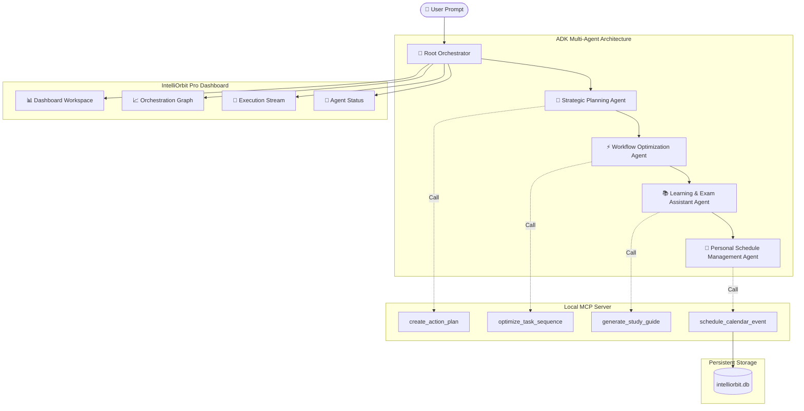

# 🚀 IntelliOrbit Pro — Full-Stack Multi-Agent Intelligent Assistant Platform 🧠⚡

An offline-first intelligent assistant platform built using Google Agent Development Kit (ADK)-inspired multi-agent orchestration and Model Context Protocol (MCP) architecture.

---

## 🌐 Live Environment

### 🚀 Runs Completely Offline

- ✅ No API keys required
- ✅ No cloud dependency
- ✅ No external AI services
- ✅ No internet connection required

⚠️ Entire system executes locally on your machine.

---

# 🚀 Overview

**IntelliOrbit Pro** is a full-stack intelligent assistant platform designed to coordinate multiple specialized AI agents to solve complex user goals through collaborative reasoning, workflow optimization, learning assistance, and personal scheduling.

The platform leverages:

- ADK-inspired multi-agent orchestration
- Model Context Protocol (MCP) tool communication
- Secure local execution
- Interactive dashboard visualization
- Fully offline deployment

---

# ✨ Key Features

## 🤖 Multi-Agent Collaboration

IntelliOrbit Pro coordinates multiple specialized agents:

- 🧠 Strategic Planning Agent
- ⚡ Workflow Optimization Agent
- 📚 Learning & Exam Assistant Agent
- 📅 Personal Schedule Management Agent
- 🎯 Root Orchestrator Agent

Features:

- Agent orchestration panel
- Pipeline execution history
- Live execution logs
- Agent status monitoring

---

## 🔌 MCP Server Integration

The platform implements MCP-inspired tool communication.

### Available Tools

- create_action_plan()
- optimize_task_sequence()
- generate_study_guide()
- schedule_calendar_event()

Capabilities:

- Tool invocation
- Tool execution logging
- Structured communication
- Agent-to-tool interaction

---

## 🔒 Security Architecture

Implemented security mechanisms:

- Input validation using Pydantic
- Permission control
- Safe local execution
- Restricted workspace access
- Secure localhost deployment

---

## 🧠 Multi-Agent Workflow

```text
              User
                │
                ▼
        Root Orchestrator
                │
      ┌─────────┼─────────┐
      ▼         ▼         ▼
 Strategic   Workflow   Learning
 Planning   Optimizer   Assistant
      │         │         │
      └─────────┼─────────┘
                ▼
        Schedule Manager
                │
                ▼
          Final Output
```

---

# 🏗 System Architecture

```text
React Frontend
       │
       ▼
FastAPI Backend
       │
       ▼
Root Orchestrator
       │
       ▼
Multi-Agent Runtime
       │
       ▼
MCP Server
       │
       ▼
SQLite Database
```

---

# 🛠 Tech Stack

| Layer | Technology |
|--------|------------|
| Frontend | React + Vite |
| Backend | FastAPI |
| Database | SQLite |
| Multi-Agent | ADK-inspired Architecture |
| Communication | MCP |
| Validation | Pydantic |
| Deployment | Local Offline Environment |

---
# 🏗️ System Architecture


# 📂 Project Structure

```text
IntelliOrbit-Pro/

backend/
├── app/
│   ├── adk/
│   ├── cli/
│   ├── mcp/
│   ├── agents_config.py
│   ├── database.py
│   ├── main.py
│   └── schemas.py
│
├── requirements.txt
├── Dockerfile
│
frontend/
├── src/
├── public/
├── package.json
│
docs/
├── architecture.md
└── ui_ux_layout.md
```

---

# ⚙️ Installation

```bash
git clone https://github.com/Nishtha-06/IntelliOrbit-Pro.git

cd IntelliOrbit-Pro

pip install -r backend/requirements.txt

cd frontend

npm install
```

---

# ▶️ Run Backend

```bash
cd backend

uvicorn app.main:app --reload
```

Backend:

```
http://localhost:8000
```

---

# ▶️ Run Frontend

```bash
cd frontend

npm run dev
```

Frontend:

```
http://localhost:5173
```

---

# 🎬 Example Workflow

User request:

> Prepare for Java placement interview in 3 months

Execution flow:

1. Root Orchestrator parses objective
2. Strategic Planning Agent creates milestones
3. Learning Agent generates study content
4. Workflow Agent optimizes sequence
5. Schedule Agent allocates calendar slots
6. Final execution log displayed

---

# 🔒 Offline First

- ✅ No OpenAI API
- ✅ No Gemini API
- ✅ No cloud services
- ✅ No internet required

Everything runs locally.

---

# 👩‍💻 Author

**Nishtha Modi**

Built for:

**Google × Kaggle AI Agents Capstone Project**

---

# 🚀 Tagline

### Plan Smarter • Learn Faster • Organize Everything
